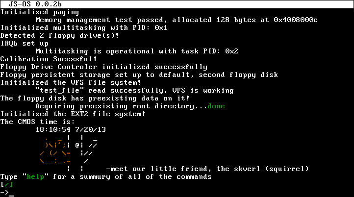
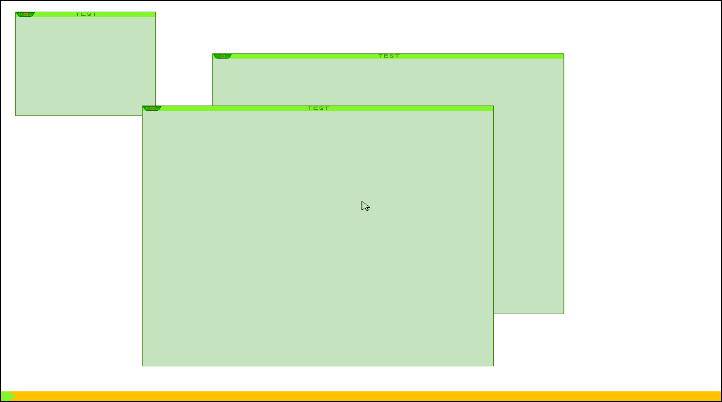
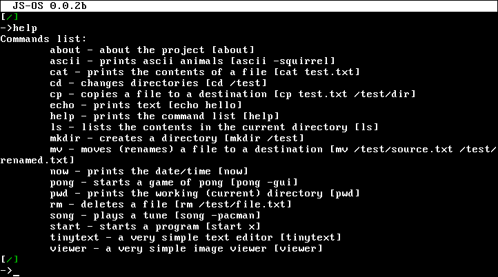
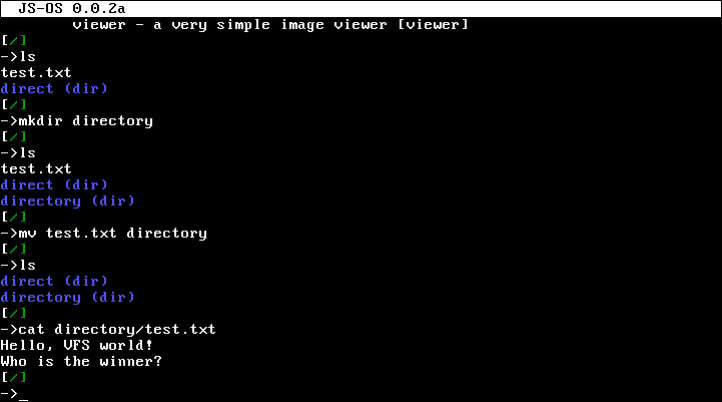
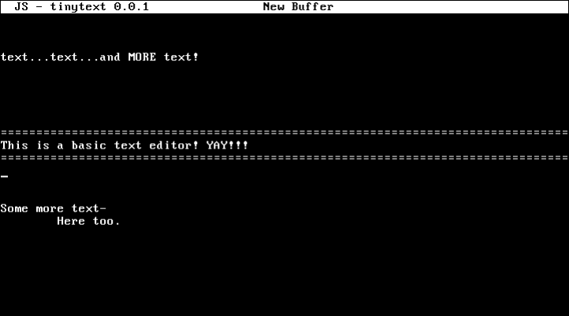

JS-OS
=====

JS-OS is a 32-bit operating system, written mostly in C, that is aiming to become a UNIX-
like clone, but with some added/better capabilities. This project was started in late 2012 by a
high school student and is meant to be a learning/research tool for both the developer and the
user. The code is mostly commented and not too difficult to follow.

Using this operating system is meant to be easy and very intuitive. It is currently under
development and supports preemptive multitasking, interrupts, an ext-2 clone file system
(supporting up to 16GB files), a bunch of file system utilities, a basic shell, a dynamic
heap, memory protection, a 32bpp VESA VBE and a VGA driver, a window manager,
keyboard and mouse driver, and a sound driver.

Compilation dependencies:
  - gcc (C compiler; built on version 4.6.3)
  - nasm (assembler; built on version 2.09.10)
  - ld (linker; built on version 2.22)

Released under the GPL license, see LICENSE for more information.
